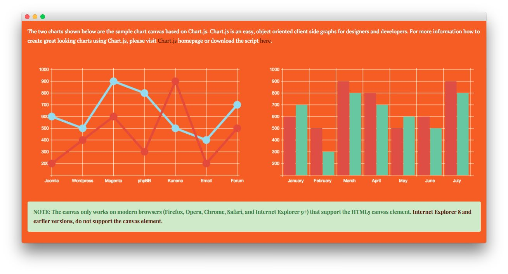

Introduction
-----

Audacity supports chart creation and management. This gives you the ability to display information in a way that matches your theme and provides extremely high visual appeal without requiring you to upload any images. It's are built on HTML5, and can be changed quickly on the back end of your site.

[Chart.js](http://chartjs.org) support is built in that allows you to create rich and infinitely useful charts within a **Text** widget, or injected directly in a post to add a powerful visual element to your written information.

>> NOTE: This feature is not currently supported in IE8. Chart.js elements will not display correctly. Newer versions of IE, as well as updated Chrome, Firefox, Safari, Opera, and other popular standard-compliant browser options should work just fine.

Chart.js Support
-----

Audacity introduces built-in support for [Chart.js](http://chartjs.org). This element allows you to quickly and easily create dynamic graphs that display information in a variety of ways.

You can toggle this feature on and off by navigating to **Administrator -> Audacity Theme -> Gizmos -> Chart** and toggling the option there. If you have a Custom HTML and/or article with the Chart.js code present, and this option is off, nothing will appear in its place and your browser may indicate a JavaScript error.

Here is the code block that creates the graphs that appear in the above image. In this case, it was placed within a **Text** widget.

~~~ .html

The two charts shown below are the sample chart canvas based on Chart.js. Chart.js is an easy, object oriented client side graphs for designers and developers. For more information how to create great looking charts using Chart.js, please visit <a href="http://www.chartjs.org/">Chart.js</a> homepage or download the script <a href="https://github.com/nnnick/Chart.js">here</a>.

 

    

    

        

            <canvas id="myChart-a" width="600" height="320"></canvas>

            
        

    

    

        

            <canvas id="myChart-b" width="600" height="320"></canvas>

            
        

    

 

NOTE: The canvas only works on modern browsers (Firefox, Opera, Chrome, Safari, and Internet Explorer 9+) that support the HTML5 canvas element. <a target="_blank" href="http://www.w3schools.com/html/html5_canvas.asp">Internet Explorer 8 and earlier versions, do not support the canvas element.</a>

~~~

You can find extensive documentation listing the different elements found here on the [official website](http://chartjs.org).

[chart_2]: assets/demo_3.jpeg
[list]: http://demo.rockettheme.com/wordpress-themes/Audacity/features/typography
