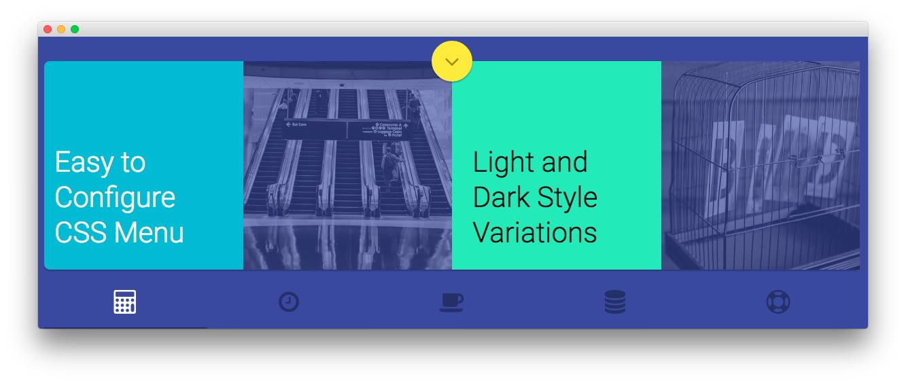

Showcase Section
-----

:   1. **Text** [15%, 50%, se]
    2. **RokSprocket (Tabs)** [30%, 5%, se]

There are two RokSprocket widgets represented in this area of the page. The one pictured above appears for devices other than phones. The other is set to display only on phones (pictured below).

Here is the widget breakdown for the Showcase section:

* [Text](#text)
* [RokSprocket (Tabs) (all devices except phones)](#roksprocket-(strips))
* [RokSprocket (Tabs) (phone only)](#roksprocket-(strips)-for-phones)

### Text

This section of the page is a standard text widget. You will need to enter the following in the main text field.

~~~ .html
<a class="rt-gotobottom wow fadeInDown"
   href="#rt-expandedbottom"
   data-scroll
   data-options='{
                    "speed": 500,
                    "easing": "easeInOutCubic",
                    "offset": 0,
                    "updateURL": false
                }'
>
    <i class="fa fa-angle-down"></i>
</a>

~~~

Leaving everything else at its default setting, select **Save**.

#### RokSprocket Tabs

You will need to do two things to prepare this widget so that it looks similar to the one in the demo.

First, you will need to create the RokSprocket Widget. You can do this by navigating to **Administration -> RokSprocket Admin** and creating a new **Tabs** widget.

You can find out more about RokSprocket and how to set up and modify widgets by visiting our [RokSprocket documentation](../../plugins/roksprocket).

**Simple Content Provider**

We used the **Simple** Content Provider to allow us to make custom tabs without having to build posts on the back-end. In this case, the **Tab Label**, **Link**, and **Description** are custom, while the other options are left at default or **None** settings. You will find the settings used in one of these items below.

| Option | Setting |
| :----- | :----- |
| Tab Label | `<i class="fa fa-fw fa-calculator"></i>` |
| Icon | None |
| Link | Custom |

*Description*

~~~ .html

The theme features contemporary design elements and structures, whilst maintaining a subtle, corporate-esque
overall appearance to maximize professionalism and visual
intrigue.
<a class="readon" href=
"http://demo.rockettheme.com/live/wordpress/cygnet/features-overview/">Learn
More</a><a class="readon2" href="#"><i class="fa fa-fw fa-play"></i> Watch
Presentation</a>

    

        

            <h2>Easy to Configure CSS Menu</h2>
        

        

            <a href="#"></a>
        

        

            <h2>Light and Dark Style Variations</h2>
        

        

            <a href="#"></a>
        

    

~~~

Here is a look at the **Tabs Layout Options** for this widget.

| Option          | Setting        |
| :-------------- | :------------  |
| Theme           | Default        |
| Display Limit   | ∞              |
| Tabs Position   | Bottom         |
| Animation       | Slide and Fade |
| Autoplay        | Disable        |
| Autoplay Delay  | 5              |
| Image Resize    | Disable        |
| Preview Length  | 0              |
| Strip HTML Tags | No             |

You can set the RokSprocket filters to include any category, specific articles, or otherwise you would like to have featured in this widget.

Once you have created this widget, you can add it via the Widgets menu by clicking **RokSprocket** and dragging it to the appropriate section. When you have done this, you will need to return to the Widgets settings and fill them out as noted below:

| Option            | Setting                                          |
| :---------------- | :----------------------------------------------- |
| Choose Widget     | (Select the RokSprocket Widget You Just Created) |
| Custom Variations | `fp-roksprocket-tabs hidden-phone`               |

Leaving everything else at its default setting, select **Save**.

#### RokSprocket (Tab) for Phones

You will need to do two things to prepare this widget so that it looks similar to the one in the demo.

First, you will need to create the RokSprocket Widget. You can do this by navigating to **Administration -> RokSprocket Admin** and creating a new **Tabs** widget.

You can find out more about RokSprocket and how to set up and modify widgets by visiting our [RokSprocket documentation](../../plugins/roksprocket).

**Simple Content Provider**

We used the **Simple** Content Provider to allow us to make custom tabs without having to build posts on the back-end. In this case, the **Tab Label**, **Link**, and **Description** are custom, while the other options are left at default or **None** settings. You will find the settings used in one of these items below.

| Option    | Setting                                  |
| :-----    | :-----                                   |
| Tab Label | `<i class="fa fa-fw fa-calculator"></i>` |
| Icon      | None                                     |
| Link      | Custom                                   |

*Description*

~~~ .html

    

        

            <a href="#"></a>
        

    

~~~

Here is a look at the **Tabs Layout Options** for this widget.

| Option          | Setting        |
| :-----          | :-----         |
| Theme           | Default        |
| Display Limit   | ∞              |
| Tabs Position   | Bottom         |
| Animation       | Slide and Fade |
| Autoplay        | Disable        |
| Autoplay Delay  | 5              |
| Image Resize    | Disable        |
| Preview Length  | 0              |
| Strip HTML Tags | No             |

You can set the RokSprocket filters to include any category, specific articles, or otherwise you would like to have featured in this widget.

Once you have created this widget, you can add it via the Widgets menu by clicking **RokSprocket** and dragging it to the appropriate section. When you have done this, you will need to return to the Widgets settings and fill them out as noted below:

| Option            | Setting                                          |
| :-----            | :-----                                           |
| Choose Widget     | (Select the RokSprocket Widget You Just Created) |
| Custom Variations | `fp-roksprocket-tabs visible-phone`              |

Leaving everything else at its default setting, select **Save**.
