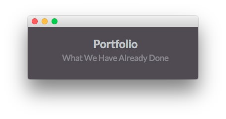
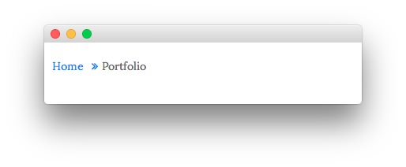
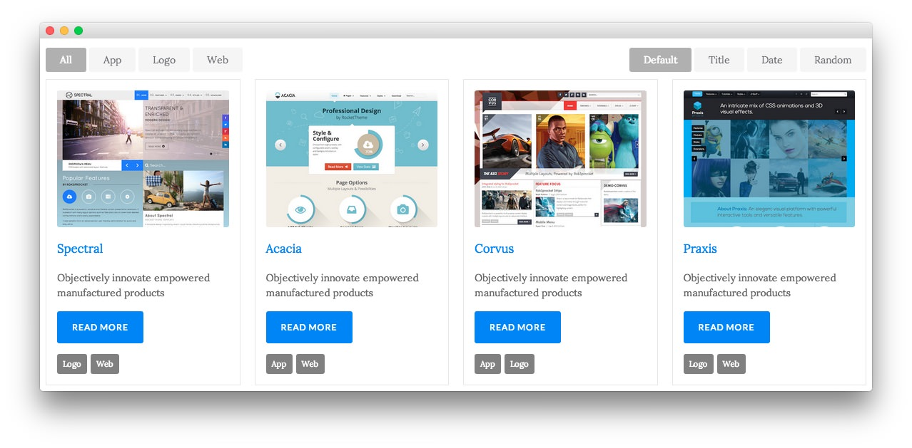
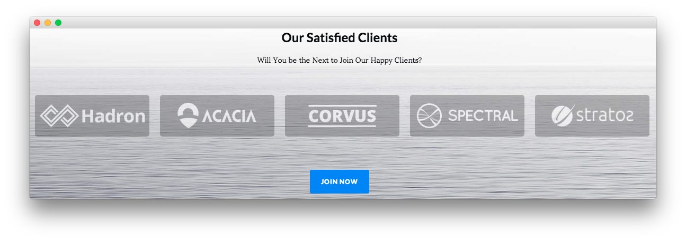

Introduction
-----

The **Portfolio** example page demonstrates how you can create a beautiful page with the Myriad template. Here is some information to help you replicate this page as it appears in the demo.

Theme Override Options
-----

The **Portfolio** page is a regular **Page**. To recreate the layout the way it appears in our demo, enter `menu-portfolio` in the **Page Suffix** field in the **Gizmos** page inside the **Myriad** theme settings. This suffix is tied to a class in the demo.less file that sets the page up so it appears the way it does in the demo.

In order for this to work, you should have the **Page Suffix** option set to **On** in **Admin > Myriad > Gizmos**. You will likely need to create a theme override specifically for the page before assigning that suffix to it. For more information on creating theme overrides, visit our [Gantry Documentation](http://gantry-framework.org/documentation/wordpress/configure/).

Mainbody
-----

The page's content body is set in the **Portfolio** page. You will find the content used in the page below.

~~~ .html
<h3>Our Awesome Project</h3>

Efficiently unleash cross-media information without cross-media value. Quickly maximize timely deliverables for real-time schemas. Dramatically maintain clicks-and-mortar solutions without functional solutions.

    

    

        

            
                
            
        

    

    

        

            <h3>Project Description</h3>
            
Efficiently unleash cross-media information without cross-media value. Quickly maximize timely deliverables for real-time schemas. Dramatically maintain clicks-and-mortar solutions without functional solutions.

            <h3>Project Details</h3>
            

                

                    

                        
Customer:

                        
Live Demo:

                        
Published Date:

                    

                

                

                    

                        
RocketTheme

                        
http://www.rockettheme.com

                        
08 March, 2014

                    

                

            

            

            
<a href="http://www.rockettheme.com/wordpress-themes/myriad" class="readon">Learn More</a>

        

    

~~~

Widgets
-----

Below is a brief rundown of the widgets used to make up the demo page. Widgets in the [**Header**](demo_header.md) and [**Copyright**](demo_copyright.md) positions are outlined in the main demo replication area of this guide.

:   1. **Showcase - Text** [10%, 45%, se]
    2. **Breadcrumbs** [11%, 14%, se]
    3. **Expanded Top - RokSprocket** [14%, 14%, se]
    4. **Mainbody** [43%, 14%, se]
    5. **Main Bottom - RokSprocket** [60%, 14%, se]
    6. **Extension - Text** [70%, 14%, se]
    7. **Bottom - Text** [82%, 14%, se]
    8. **Bottom - Text** [82%, 52%, se]

1. [Showcase - Text](portfolio.md#showcase-section)
2. [Breadcrumbs](portfolio.md#breadcrumbs-section)
3. [Expanded Top - RokSprocket](portfolio.md#expanded-top-section)
4. [Mainbody](portfolio.md#mainbody)
5. [Main Bottom - RokSprocket](portfolio.md#main-bottom-section)
6. [Extension - Text](portfolio.md#bottom-section)
7. [Bottom - Text](portfolio.md#footer-section)
8. [Bottom - Text](portfolio.md#footer-section)

Showcase Section
-----

Here is the widget breakdown for the Showcase section:

#### Text

This section of the page is a standard text widget. You will need to enter the following in the main text field.

~~~ .html
&nbsp;
~~~

Here is a breakdown of options changes you will want to make to match the demo.

* Set the **Title** to `Portfolio[span class="rt-title-tag"]What We Have Already Done[/span]`.
* Switch the **Widget Variations** option to **RT-Center, No Margin All**.
* Enter `rt-title-large rt-nomodulecontent rt-top-large-padding` in the **Custom Variations** field.
* Leaving everything else at its default setting, select **Save**.

Breadcrumbs Section
-----

#### Gantry Breadcrumbs

The **Gantry Breadcrumbs** widget gives you the ability to present page-aware breadcrumbs on the page. All you need to do to add them is to drag the **Gantry Breadcrumbs** widget from the **Available Widgets** area to the **Breadcrumbs** widget position.

Expanded Top Section
-----

Here is a breakdown for the **Expanded Top** section:

#### RokSprocket (Mosaic)

This area of the demo is a RokSprocket widget. You will need to do two things to prepare this widget so that it looks similar to the one in the demo.

First, you will need to create the RokSprocket Widget. You can do this by navigating to **Administration -> RokSprocket Admin** and creating a new **Mosaic** widget.

You can find out more about RokSprocket and how to set up and modify widgets by visiting our [RokSprocket documentation](../../plugins/roksprocket).

**Simple Content Provider**

In this instance, we used the **Simple** content provider in order to allow us to create custom items, without having to create posts to connect them to. The **Title** and **Description** fields of these items are custom, with custom images set, as well. Any tags set appear below the description on the frontend.

| Option      | Setting                                                |
| :---------- | :----------                                            |
| Title       | `Spectral`                                             |
| Description | `Objectively innovate empowered manufactured products` |
| Image       | Custom                                                 |
| Link        | Custom                                                 |
| Tags        | `logo, web`                                            |

Here is a look at the **Mosaic Layout Options** for this widget.

| Option          | Setting                      |
| :-------------- | :--------------------------- |
| Theme           | Default                      |
| Display Limit   | ∞                            |
| Columns         | 4                            |
| Preview Length  | ∞                            |
| Only Show Tags  |                              |
| Strip HTML Tags | No                           |
| Blocks Per View | 8                            |
| Article Details | Hide Author and Date         |
| Block Animation | Fade, Scale, Rotate          |
| Ordering        | Default, Title, Date, Random |
| Image Resize    | Disable                      |

Once you have created this widget, you can add it via the Widgets menu by clicking **RokSprocket** and dragging it to the appropriate section. When you have done this, you will need to complete the following.

* Select your RokSprocket Featured widget in the **Choose Widget** field.
* Leaving everything else at its default setting, select **Save**.

The widget should now be created and ready for use on the front page of your WordPress site.

Main Bottom
-----

Here is a breakdown for the **Main Bottom** section:

#### RokSprocket (Strips)

This area of the demo is a RokSprocket widget. You will need to do two things to prepare this widget so that it looks similar to the one in the demo.

First, you will need to create the RokSprocket Widget. You can do this by navigating to **Administration -> RokSprocket Admin** and creating a new **Strips** widget.

You can find out more about RokSprocket and how to set up and modify widgets by visiting our [RokSprocket documentation](../../plugins/roksprocket).

##### Simple Provider

We used the **Simple Provider** to enable us to create custom RokSprocket content without having to create separate articles or pages to do so. Here are the details of one of the **Simple Items** in the **Featured Article List**.

| Option      | Setting     |
| :---------- | :---------- |
| Title       | None        |
| Image       | None        |
| Link        | None        |

**Description**

~~~ .html

RokAjaxSearch is a configurable search widget that uses AJAX to load results in real time via a styled popup. It can be set to local or Google search, inclusive of Web, image, video and blog. Results are paged and can be accessed via buttons or keyboard commands.

~~~

Here is a look at the **Strips Layout Options** for this widget.

| Option            | Setting      |
| :----------       | :----------  |
| Theme             | Default      |
| Display Limit     | ∞            |
| Preview Length    | ∞            |
| Strip HTML Tags   | No           |
| Previews Per Page | 1            |
| Items Per Row     | 1            |
| Arrow Navigation  | Hide         |
| Pagination        | Show         |
| Animation         | Fade Delayed |
| Autoplay          | Disable      |
| Autoplay Delay    | 5            |
| Image Resize      | Disable      |

You can set the RokSprocket filters to include any category, specific articles, or otherwise you would like to have featured in this widget.

Once you have created this widget, you can add it via the Widgets menu by clicking **RokSprocket** and dragging it to the appropriate section. When you have done this, you will need to complete the following.

* Enter `What Our Clients Say` in the **Title** field.
* Select your RokSprocket Featured widget in the **Choose Widget** field.
* Set the **Widget Variations** to **RT-Center**.
* Leaving everything else at its default setting, select **Save**.

The widget should now be created and ready for use on the front page of your WordPress site.

Extension Section
-----

Here is a breakdown for the **Extension** section:

#### Text

This section of the page is a standard text widget. You will need to enter the following in the main text field.

~~~ .html

Will You be the Next to Join Our Happy Clients?

 

    

    

        

            
        

    

    

        

            
        

    

    

        

            
        

    

    

        

            
        

    

    

        

            
        

    

  

<a href="http://www.rockettheme.com/wordpress-themes/myriad" class="readon">Join Now</a>

~~~

Here is a breakdown of options changes you will want to make to match the demo.

* Set the **Title** to `Our Satisfied Clients`.
* Set the **Widget Variations** option to **RT-Center**.
* Leaving everything else at its default setting, select **Save**.

Bottom Section
-----

:   1. **Text 1** [20%, 5%, se]
    2. **Text 2** [20%, 52%, se]

#### Text 1

This section of the page is a standard text widget. You will need to enter the following in the main text field.

~~~ .html

These examples are intended to show how Myriad can be constructed on your site, above and beyond the frontpage demonstration. These include WordPress content with varying widgetized content, mainbody widths and page lengths.

All demo content is for sample purpose only, intended to show a live site. Use the <a href="http://www.rockettheme.com/wordpress/themes/myriad">Myriad RocketLauncher</a> to install an equivalent of the demo onto your site.

~~~

Here is a breakdown of options changes you will want to make to match the demo.

* Set the **Title** to `Myriad Demo`.
* Enter `rt-phone-center` in the **Custom Variations** field.
* Leaving everything else at its default setting, select **Save**.

#### Text 2

This section of the page is a standard text widget. You will need to enter the following in the main text field.

~~~ .html

Completely synergize resource sucking relationships via premier niche markets. Professionally cultivate one-to-one customer service with robust ideas.

    

        

            
        
  
    

    

        

            +1(123)456-5555-555 
            Myriad Theme, LLC 
            123 WordPress Boulevard 
            Seattle, WA 00000, USA 
            <a href="#">noreply@domain.com</a>
        

    

~~~

Here is a breakdown of options changes you will want to make to match the demo.

* Set the **Title** to `Sample Contact Info`.
* Enter `rt-phone-center` in the **Custom Variations** field.
* Leaving everything else at its default setting, select **Save**.
